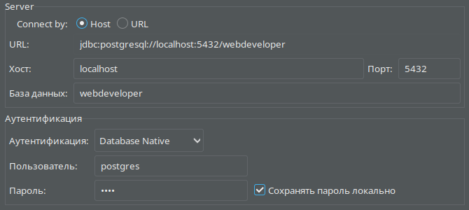

# web_developer тестовое
# Инструкция
## Используемый стек:
- `python 3.11`
- `django 4.2`
- `psycopg2 2.9.6`
- `postgreSQL 15.2`

## В проекте присутствует `venv`. Библиотеки для работы `venv`:
- `django 4.2`
- `psycopg2 2.9.6`
- `pillow 9.5.0`

## База данных:
- в терминале вводим `sudo -u postgres psql`
- создаем базу данных с именем `webdeveloper`, используя команду `CREATE DATABASE webdeveloper;`
- создаем пользователя с именем `webdeveloperuser` и паролем `1234`, используя команду `CREATE USER webdeveloperuser WITH PASSWORD '1234';`
- после этого нужно изменить несколько параметров подключения только что созданного пользователя. Это ускорит операции с базой данных.
  - `ALTER ROLE webdeveloper SET client_encoding TO 'utf8';`
  - `ALTER ROLE webdeveloper SET default_transaction_isolation TO 'read committed';`
  - `ALTER ROLE webdeveloper SET timezone TO 'UTC';`
- для создания записи в базе данных можно использовать панель администратора по адресу `http://127.0.0.1:8000/admin`, либо используя консоль.
  - для того чтобы войти в консоль и добавить запись необходимо:
    - перейти в директорию с проектом
    - выполнить команду `python manage.py shell`
    - подключить модели `from book.models import *`
    - чтобы добавить запись, необходимо в терминале выполнить следующую команду `b1 = Book(name='Имя книги', author='Имя автора', date_published='Год', description='Краткое описание книги')`
    - сохраняем запись `b1.save()`
- для удобно просмотра базы данных я использую `DBeaver`. Ниже расположен скриншот подключения к базе данных

## Функционал:
- Регистрация и авторизация для пользователей
- Комментирование книг
- Редактировать и удалять комментарии может только тот пользователь, которых их создал
- Поиск книг по названию и автору
- `CRUD` операции над книгами в панели администратора

## План проекта
### 05.04.2023
- [x] создано приложение 
- [x] создана и наполнена база данных
- [x] вывод книжек на страничке
- [x] небольшой дизайн
### 06.04.2023
- [x] разобраться в дизайне
- [x]  добавить в таблицу `Book` столбец `Description`
- [x]  добавить и связать таблицу `Commnents`
- [x]  добавить и связать таблицу `Category`
- [x]  сделать распределение по жанрам
- [x]  добавить изображения книг
- [x]  возможно сделал CRUD в режиме админа
### 07.04.2023
- [x]  сделать открытие книги по кнопке
- [x]  сделать маршрутизацию по всем кнопкам
### 08.04.2023
- сделать форму регистрации и входа
- нормально задизайнить
